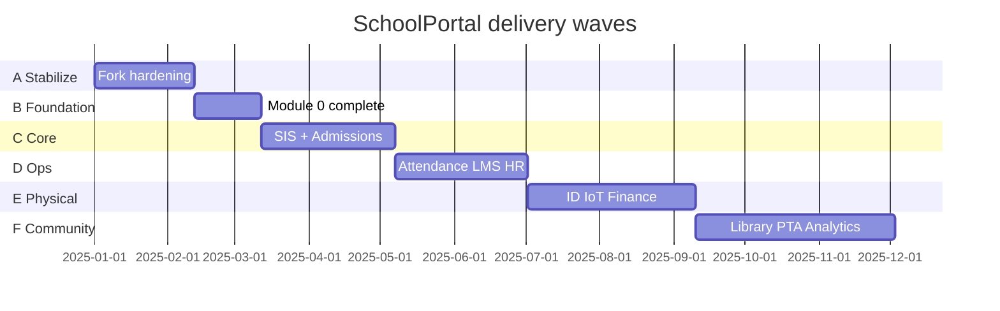

# SchoolPortal — Master Build Roadmap

**Original reference:** [iamtonmoy0/node-express-school-management-system](https://github.com/iamtonmoy0/node-express-school-management-system)  
**Target product:** Nigeria Nursery · Primary · Secondary school platform (Modules 0–12)

---

## Vision

One backend serving multiple campuses, three academic tiers, RBAC for 10+ roles, and twelve product modules—from admissions through analytics—while preserving and hardening APIs from the original open-source starter.

---

## Current state (baseline)

| Layer | Status |
|-------|--------|
| Express API + route auto-sync | ✅ From original |
| PostgreSQL + Prisma | ✅ Replaced MongoDB |
| Core academic CRUD (terms, years, classes, programs, subjects, exams, questions, results) | ✅ Ported to Prisma |
| Auth (admin / teacher / student JWT) | ✅ Working |
| Module 0 foundation (tiers, RBAC seed, org/campus, audit) | ✅ Core delivered |
| Original stub endpoints | ✅ Implemented (Phase A) |
| Modules 1–2 SIS + Admissions MVP | ✅ Phase C |
| Parent / PTA / promotion / uploads / unified auth | ✅ Phase C+ slice |
| Module 5 Attendance (roll-call, timetable, door import) | ✅ Phase D MVP |
| Module 6 LMS (courses, assignments, gradebook, live classes) | ✅ Phase D MVP |
| Modules 3–4, 8–12 (MVP slices) | ✅ Delivered (see IMPLEMENTATION_STATUS.md) |
| Frontend (`web/`) | ✅ React app on ports 5340/5345 |
| Tests / OpenAPI | 🟡 Partial (16+ HTTP integration tests, schema tests, expanded OpenAPI) |

---

## Build phases (recommended order)

### Phase A — Stabilize the fork ✅ Delivered

**Goal:** Production-safe port of the original repo on Postgres.

| # | Work item | Source | Priority |
|---|-----------|--------|----------|
| A1 | Run migrations + seed; document first admin bootstrap | New | P0 |
| A2 | Implement **stub routes** from original (see gap doc) | Original | P0 |
| A3 | Wire **RBAC** on all existing routes (`requirePermission`) | New | P0 |
| A4 | Add `campusId` + `tier` to all create/update academic APIs | New | P1 |
| A5 | Global error handler, validation (Zod), secure `isLoggedIn` | Original gaps | P0 |
| A6 | OpenAPI / Postman collection for all v1 routes | New | P1 |
| A7 | Integration tests for auth + exam flow | New | P1 |

**Exit criteria:** All original endpoints behave correctly; no placeholder JSON responses; tier/campus on student/class.

---

### Phase B — Module 0 complete ✅

| # | Work item | Status |
|---|-----------|--------|
| B1 | Notification worker | ✅ `npm run worker:notifications` |
| B2 | Audit on academic + SIS + admissions mutations | ✅ |
| B3 | Unified login `POST /auth/login` | ✅ |
| B4 | SSO (Google / Microsoft) stubs | ✅ status + 501 until env configured |
| B5 | Campus headers on new modules | ✅ |

---

### Phase C — Core SIS + Admissions ✅ (MVP delivered)

| Module | Deliverables | Status |
|--------|----------------|--------|
| **2 SIS** | 360° profile, health, emergency contacts, document vault | ✅ MVP |
| **1 Admissions** | Inquiry, applicant portal, documents, interview, enroll → Student | ✅ MVP |
| **2 SIS** | Class mass-assign, promotion engine, multer uploads | ✅ |
| **10 PTA** | Parent register/login, dashboard, PTA messaging | ✅ MVP |

**Depends on:** Phase A/B.

---

### Phase D — Daily operations (in progress)

| Module | Deliverables | Status |
|--------|----------------|--------|
| **5 Attendance** | Roll-call, summaries, timetable slots, conflicts, substitutions, door import | ✅ MVP |
| **6 LMS** | Courses, assignments, submissions, live sessions, gradebook | ✅ MVP |
| **9 HR** | Staff profiles, leave workflow, payroll hooks, performance reviews | Planned |

---

### Phase E — Physical & money (6–8 weeks)

| Module | Deliverables |
|--------|----------------|
| **3 ID Cards** | WYSIWYG designer, QR/barcode, print queue |
| **4 IoT Access** | Controller broker, rules matrix, live monitor, lockdown |
| **8 Finance** | Fee structures, gateways, defaulters, RFID wallet, ledger |

---

### Phase F — Community & intelligence (ongoing)

| Module | Deliverables |
|--------|----------------|
| **7 Library** | OPAC, DRM viewer, circulation, fines |
| **10 PTA** | Parent dashboard, messaging, meetings, polls |
| **11 Ancillary** | Transport GPS, cafeteria menus |
| **12 Analytics** | Report cards, executive dashboard, retention flags |

---

## Sprint map (12 sprints × 2 weeks)

---

## Nigeria tier rollout

Apply tier scope in this order:

1. **Seed grades** — already in `prisma/seed.js` (Pre-Nursery → SS 3).
2. **ClassLevel** — link each class to `tier` + `gradeLevelId` + `campusId`.
3. **Student enrollment** — require tier on register; filter lists by tier.
4. **Exams & results** — tier-specific question banks and report cards.
5. **Fees & attendance** — tier-specific fee schedules (Module 8/5).

---

## Team roles (suggested)

| Role | Owns |
|------|------|
| Backend lead | Prisma schema, Module 0, API conventions |
| Domain dev (academic) | Phases C–D (SIS, LMS, attendance) |
| Integrations | SSO, payments, SMS, IoT broker |
| Frontend (separate repo) | Consumes `/api/v1`; not in original repo |

---

## Success metrics per phase

| Phase | Metric |
|-------|--------|
| A | 100% original routes implemented; 0 stub controllers |
| B | Audit row on every admin mutation; RBAC on 100% protected routes |
| C | Applicant → active student < 5 API calls |
| D | Timetable conflict rate 0%; attendance synced daily |
| E | ID print + access scan E2E demo |
| F | Executive dashboard loads < 3s |

---

## Related documents

- [BUILD_SCHEME.md](./BUILD_SCHEME.md) — how to structure code and database changes
- [ORIGINAL_REPO_GAP_ANALYSIS.md](./ORIGINAL_REPO_GAP_ANALYSIS.md) — original vs SchoolPortal vs new modules
- [PRODUCT_ROADMAP.md](./PRODUCT_ROADMAP.md) — module 0–12 feature list
